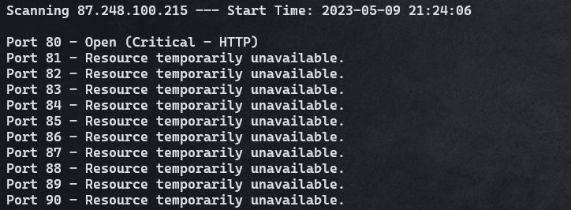

# Python Port Scanner Project

This python script can scan port or range of ports on an IP or a domain name using `socket` library.

## Features
* Can handle input errors.
* Accept the target as IPv4 or a domain name.
* Can perform the scan on a single port or a range of ports.
* Can choose socket errors that will stop the scan once any of them appears using `stop_errors` file.
* Change the message for any socket error value using `socket_errors` file.
* Display a hint with some ports that can be used in cybercrime, you can edit these ports and its popular service/s using `critical_ports` file.
* Display a real time scan status.
* Saves a summary of the scan in a `logs.txt` file.

## Usage
you can pass the target IP and ports to the `PortScanner.py` script as an arguments from CTI
(Command Line Interface) or simply run the script,
and it will ask you to enter them.

IP can be passed as IPv4 or Domain name that can be resolved.

Port/s can be passed in two forms:
* Single Port: `number` (in range form 1 to 65535)
* Range of Ports: `number-number` (two numbers in the same range separated by a dash)

Example of scanning a range of ports.

During the scanning process, you will see a real time logs for all ports.

After finishing the scanning process a summary will be displayed for only open ports, this summary also saved in `logs.txt` file.

Example of scanning a single port.

## Contributing
Feel free to contribute.
Don't hesitate to refactor the current code base.
This project is mainly built for educational and demonstration purposes, so verbose documentation is welcome.
